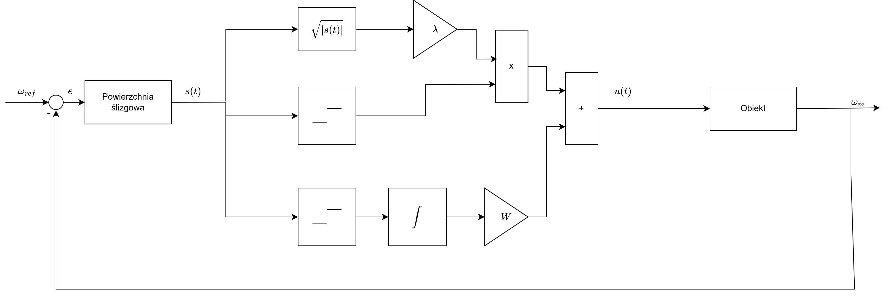
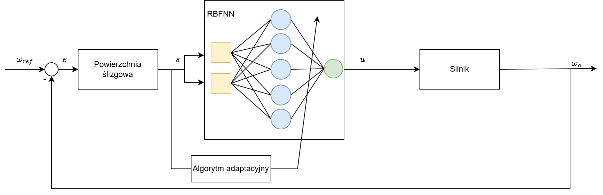
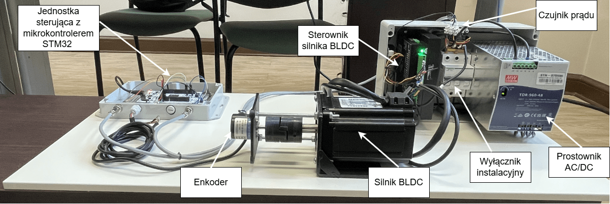
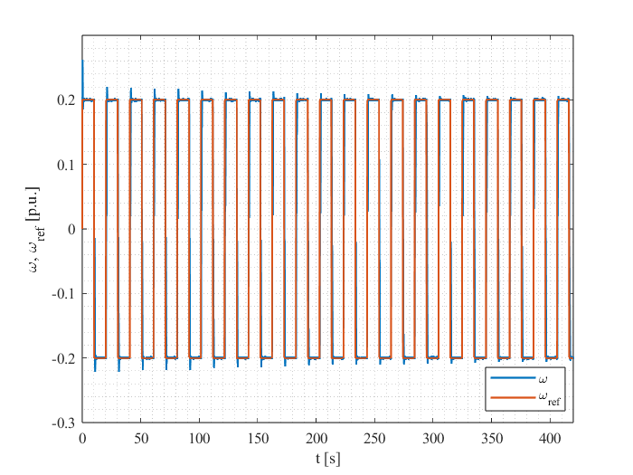
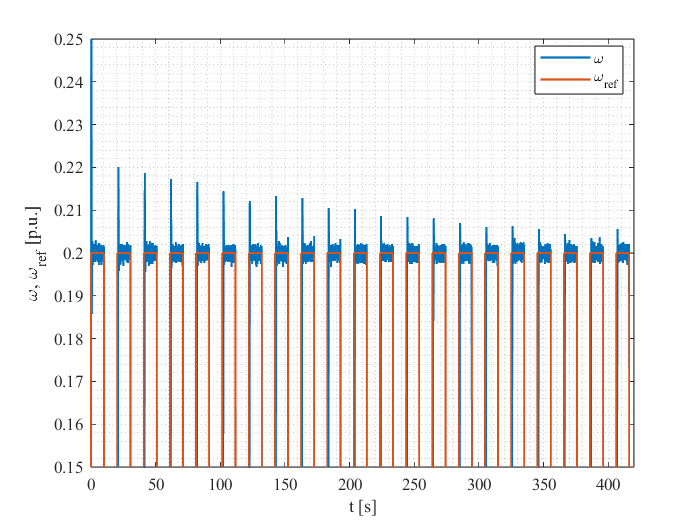

# Adaptive and Sliding Mode Speed Control of a BLDC Motor on an STM32 Platform

## Overview
This repository presents the practical and simulation-based work carried out as part of my engineering thesis on **BLDC motor speed control using sliding mode methods and artificial neural networks**.

The project focuses on the design, simulation, implementation, and experimental validation of two advanced speed controllers for a BLDC motor:

- **Super-Twisting Sliding Mode Controller (ST-SMC)**
- **Adaptive controller based on a Radial Basis Function Neural Network (RBFNN)**

The work combines theoretical analysis, simulation studies in **MATLAB/Simulink**, and real-time implementation on an **STM32 microcontroller** in a laboratory setup.

---

## Thesis Goal
The main goal of this thesis was to investigate whether advanced sliding mode control methods, especially their modern extensions, can provide effective and robust speed control of a BLDC motor in both simulation and real experimental conditions.

The project was also intended to evaluate the practical usefulness of:
- **MATLAB/Simulink** as a rapid prototyping environment,
- **STM32-based embedded implementation**,
- and **artificial intelligence methods**, particularly **RBF neural networks**, in electric drive control applications.

---

## Main Contributions
This work includes:

- a literature review on **BLDC motor control methods** and **sliding mode control**,
- presentation of the **mathematical model of the BLDC motor**,
- development of a **general speed control structure**,
- analysis of the **classical Sliding Mode Controller (SMC)**,
- implementation and simulation of a **Super-Twisting Sliding Mode Controller (ST-SMC)**,
- implementation and testing of an **adaptive speed controller using an RBF neural network**,
- real-time deployment of selected controllers on an **ARM-based STM32 platform**,
- comparison between simulation results and experimental results,
- discussion of practical implementation issues and further development directions.

---

## Project Structure
The work was divided into two main parts:

### 1. Theoretical and Simulation Part
This part includes:
- BLDC motor modeling,
- theoretical background of sliding mode control,
- analysis of the classical SMC and its chattering problem,
- simulation of ST-SMC in Simulink,
- simulation of an adaptive RBFNN-based sliding controller.

### 2. Experimental Part
This part includes:
- implementation of controllers on an STM32-based laboratory platform,
- preparation of the test bench,
- integration of Simulink with STM32,
- real-time experiments for ST-SMC and RBFNN-based control,
- analysis of measured speed, motor current, and control signal.

---

## Technologies and Tools
The following tools and technologies were used in this project:

- **MATLAB/Simulink**
- **Simulink Data Inspector**
- **STM32 microcontroller**
- **STM32CubeMX**
- **USART communication**
- **Encoder-based speed measurement**
- **PWM motor control**

---

## Control Methods

### Classical Sliding Mode Control (SMC)
The thesis first introduces the classical sliding mode controller as a reference approach.  
Simulation studies confirmed that SMC is an effective speed controller for a BLDC motor, but also clearly showed its main drawback: **chattering**.

### Super-Twisting Sliding Mode Control (ST-SMC)
To address the limitations of classical SMC, the project investigated **Super-Twisting Sliding Mode Control**, a higher-order sliding mode method that shifts discontinuous control action to higher derivatives of the sliding variable.

The controller was tested in simulation and later implemented experimentally.

### Adaptive RBFNN-Based Controller
The final control approach was an **adaptive speed controller based on a Radial Basis Function Neural Network (RBFNN)**.

This controller combines sliding-mode-inspired robustness with neural adaptation capabilities.  
Its effectiveness was confirmed both in simulation and in real experimental tests.

---

## Key Conclusions
The thesis demonstrates that **sliding mode control**, especially its more advanced variants, is an effective method for BLDC motor speed control.

The results also show that the development of **artificial intelligence methods** can positively influence electric drive automation, particularly in adaptive control tasks.

The work confirms that:

- the **simulation stage in MATLAB/Simulink** is essential for the initial verification of control algorithms,
- simulation alone is not sufficient for a reliable assessment of controller quality,
- real-world implementation reveals effects that are often neglected in simulation models,
- integration of **MATLAB/Simulink** with **STM32** enables efficient transfer of algorithms from simulation to real-time hardware implementation.

---

## Future Work
Possible future extensions of this work include:

- investigation of other neural network structures and learning methods,
- comparison of different AI-based adaptive control strategies,
- improvement of the laboratory load control system,
- comparison between:
  - automatically generated code from Simulink,
  - and manually optimized embedded C implementation,
- battery-powered standalone version of the controller,
- addition of a user interface for reference speed setting and signal visualization,
- replacing PC-based reference transmission via USART with local input devices such as a potentiometer connected to the ADC,
- adding a physical display or a web-based dashboard showing:
  - reference speed,
  - measured speed,
  - motor current,
  - and other live system parameters.

## Images / Gallery

### ST-SMC Control Structure

### RBFNN Controller Structure

### Laboratory Setup

### Step Change in Speed Reference — ST-SMC

### Reversals (Zoomed View) — RBFNN

